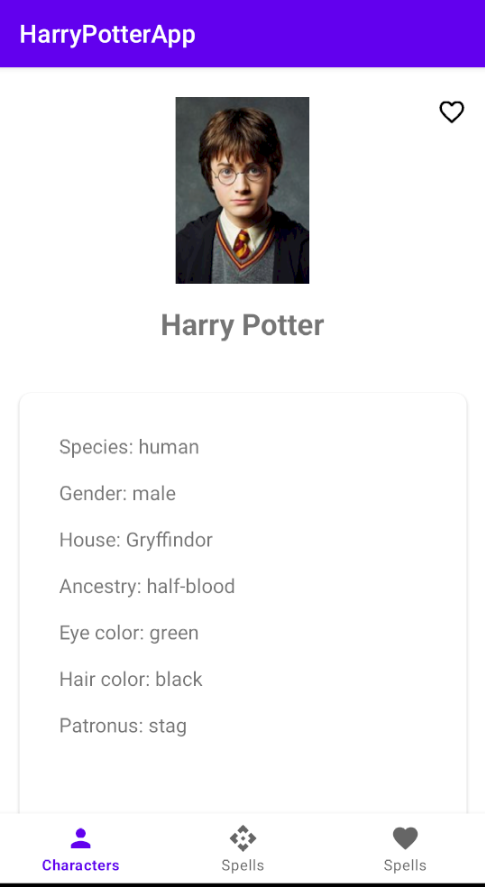

# Harry Potter App

|  Main Screen  |         Details Screen         |
|:-------------:|:------------------------------:|
|  |  |

## Features

- list of characters
- list of spells
- characters details screen
- add character or spell to favorites

API used in this app: [HP-API](https://hp-api.onrender.com/)

## Tech Stack and Architecture

- Kotlin
- MVVM
- Retrofit, OkHttp, GSON, Coil (Image Loading)
- Room Database
- Kotlin Coroutines
- RecyclerView, Fragments
- Jetpack ViewModel, Lifecycle
- Coroutines Flow, StateFlow
- Navigation Component
- Viewbinding
- Dagger-Hilt

## Contacts

- mark130599@gmail.com
- Telegram: @mark_gardie
- [Linkedin](https://www.linkedin.com/in/mark-gardie/)